# mosaicHAT


mosaicHAT: A GNSS HAT for Raspberry PI </br>
Author: (Jamal Sa'd) <jamalhazem127@gmail.com> </br>
Maintainer: (Septentrio gnss github user) <githubuser@septentrio.com> </br>
External website: https://github.com/septentrio-gnss/mosaicHAT </br>
License: <a href="https://creativecommons.org/licenses/by-sa/4.0/">Creative Commons Attribution Share-Alike License.</a> and <a href="https://www.oshwa.org/definition/">Open Source HW</a>

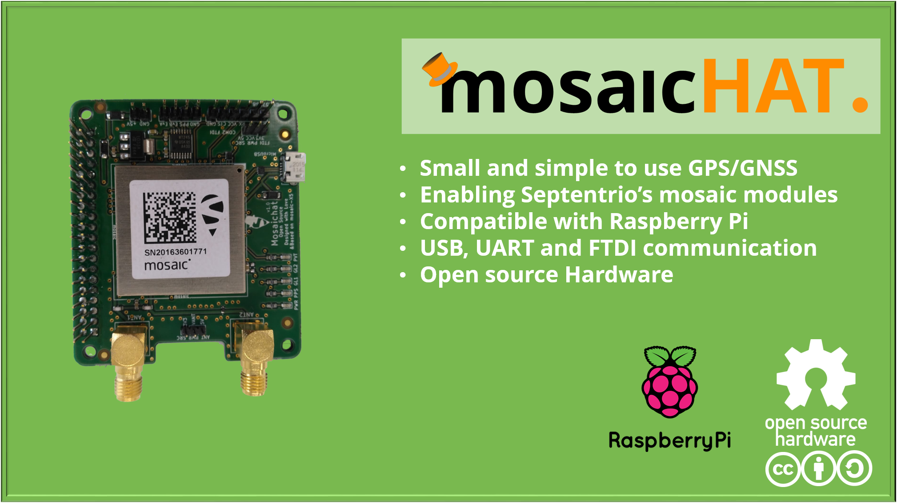

Table of contents
=================
<!--ts-->
   * [Introduction to mosaicHAT](#introduction-to-mosaichat)
      * [What is mosaicHAT?](#what-is-mosaichat)
      * [A HAT for Raspberry Pi?](#a-hat-for-raspberry-pi)
      * [What is the mosaic module?](#what-is-the-mosaic-module)
      * [Who is Septentrio?](#who-is-septentrio)
      * [Is the project Open Source?](#is-the-project-open-source)
      * [Disclaimer](#disclaimer)
   * [mosaicHAT user documentation](#mosaichat-user-documentation)
      * [mosaicHAT Manufacturing and Assembly](#mosaichat-manufacturing-and-assembly)
      * [general interfaces of mosaicHAT](#general-interfaces-of-mosaichat)
      * [Connecting to Raspberry Pi](#connecting-to-raspberry-pi)
      * [Connecting an antenna](#connecting-an-antenna)
      * [USB Communication](#usb-communication)
      * [Serial Communication](#serial-communication)
      * [FTDI-connector](#ftdi-connector)
      * [General Purpose LEDs](#general-purpose-leds)
      * [Reset Connector](#reset-connector)
      * [events](#events)
      * [PPS Output](#pps-output)
      * [ROS support with ROSaic](#ros-support-with-rosaic)
   * [mosaicHAT Design documentation](#mosaichat-design-documentation)
      * [mosaic Pinout](#mosaic-pinout)
      * [Power Sources](#power-sources)
      * [Antennas](#antennas)
      * [Raspberry Pi Serial](#raspberry-pi-serial)
      * [Reset Input](#reset-input)
      * [Micro USB](#micro-usb)
      * [Events and PPSO](#events-and-ppso)
      * [FTDI](#ftdi)
      * [LEDs](#leds)
      * [Clock Frequency Reference ](#clock-frequency-reference )
   * [Further improvements](#further-improvements)
<!--te-->

## Introduction to mosaicHAT
### What is mosaicHAT?
The mosaicHAT is an Open Source GPS/GNSS HW PCB HAT which integrates <a href="https://www.septentrio.com/en/products/gnss-receivers/rover-base-receivers/receivers-module/mosaic">Septentrio's mosaic-X5</a> GNSS module (and other Septentrio pin compatible modules such as <a href="https://www.septentrio.com/en/products/correction-services/precise-point-positioning-services-land/secorx-s/mosaic-sx">Septentrio's mosaic-Sx</a>) with basic communications and which can be stacked into a Raspberry Pi system. 

The goal of the design is to allow easy HW prototyping using the mosaic-X5 GNSS module taking the advantage of the computer ecosystem provided by the Raspberry Pi environment. The board however can also be used standalone since it can be powered either via USB or via power pins. 
This project and design can be used either produced with your local electronics assembly house or can also be used as an starting point for your own HW integrations.

### A HAT for Raspberry Pi?
HAT stands for “Hardware attached on top”. It is a new hardware specification for add-one modules for the new Raspberry Pi model B+. HATs have several advantages compared to older add-on modules for the Raspberry Pi.
#### No soldering, just plug it onto the Raspbery Pi
With our older HiFiBerry boards you had to solder an 8-pin header onto the Raspberry Pi. While this is not a problem for experienced hackers, not everybody owns a solder station and can do this.
#### Robust mechanical design
With 4 mounting holes the connection between the Raspberry Pi and the add-on board is very robust. 

### Can I buy it?
At this moment we do not know of anybody who sells the manufactured version of this board. However you can use the reference design, layout and contact your local manufacturing company for producing it (no restrictions). Within this project we have used [Eurocircuits](https://www.eurocircuits.com/) who can be quite fast in producing a board for you (both PCB and assembly can be done by them). Section [mosaicHAT Manufacturing and Assembly](#mosaichat-manufacturing-and-assembly)

#### Do I need to source special components for producing this board?
Not really, most of the components are generic enough. The mosaic GNSS module can be obatined from Digikey or directly from Septentrio. Should you project be larger then we recommend you to contact Septentrio sales team directly at <sales@septentrio.com>.

### What is the mosaic module?
#### mosaic-X5
<a href="https://www.septentrio.com/en/products/gnss-receivers/rover-base-receivers/receivers-module/mosaic">Septentrio's mosaic-X5</a>, a multi-band, multi-constellation GNSS receiver in a low power surface mount module with a wide array of interfaces, designed for mass market applications like robotics and autonomous systems, capable of tracking all Global Navigation Satellite System (GNSS) constellations supporting current and future signals. With unique built-in AIM+ technology for interference mitigation, Septentrio is offering a performance benchmark in mass market GNSS positioning building blocks.

#### mosaic-Sx
<a href="https://www.septentrio.com/en/products/correction-services/precise-point-positioning-services-land/secorx-s/mosaic-sx">Septentrio's mosaic-Sx</a> module offers a unique approach to GNSS positioning. It provides convenient always-on high-accuracy positioning right out of the box. No need for any additional correction service selection, subscription and maintenance. This is made possible by an integration of a PPP-RTK sub-decimeter correction service into Septentrio’s latest core GNSS technology. With all-in-view satellite tracking and unmatched anti-jamming technology mosaic-Sx offers a perfect combination of convenience and performance in a very small size factor.

#### Other mosaic versions
Any other mosaic pin compatible products could also be used on this design, however you would need to take into consideration the functions or pins which would need to exposed and then modify the design for your own project. Surely feel free to spin of the project and refer to this one should you make other open source designs based on mosaicHAT.

### Who is Septentrio?

Septentrio designs, manufactures and sells high-precision, multi-frequency, multi-constellation GPS/GNSS equipment for use in demanding applications. Septentrio products are used in a wide variety of industries including marine, construction, precision agriculture, logistics, machine control, rail, automotive, survey and mapping, geographic information systems (GIS), unmanned aerial vehicles (UAVs) and scientific. Septentrio receivers deliver consistently accurate and precise GNSS positioning scalable to centimeter-level and designed to perform solidly in the most challenging environments. Septentrio receivers are available as OEM boards, housed receivers and smart antennas.

The technology offers high accuracy and reliability thanks to GNSS+ algorithms as well as <a href="https://www.septentrio.com/en/advanced-interference-monitoring-mitigation-aim">Septentrio's Advanced Interference Monitoring and Mitigation (AIM+)</a> which protects against RF interference (jamming) and spoofing.

For more information about Septentrio products go to <http:\\www.septentrio.com>.

### Deliverables
This project makes the following deliverables for both integrators and designers of systems around Septentrio's mosaic modules.

|File|Description|
|--------|----------|
|KiCAD_files/HATv1.0.pro| KiCAD project |
|KiCAD_files/HATv1.0.kicad_pcb | KiCAD layout |
|KiCAD_files/HATv1.0.sch| KiCAD schematic |
|KiCAD_files/mosaicHAT_library.lib| Project schematic library |
|mosaic_design_components/mosaic_X5.mosaic-X5.lib | mosaic symbol |
|mosaic_design_components/mosaic_X5.kicad_mod| mosaic footprint |
|mosaic_design_components/mosaic3D.stp| mosaic 3D object |


### Is the project open source?
Yes, as it allows easy adaptations and thus enables the robotics and autonomous community to create their own spin off projects.
As such this can be also a starting reference point for integrators when in need of GNSS integration.

With open source it means that the following is provided:
-Editable source files
-Modifications and spinn off projects allowed
-You are allowed to sell your version. No -NC limitations.
-May require attribution
-We encourage you to stand on our shoulders and even make money at it! 

More info about licensing can be found here: 
<a href="https://creativecommons.org/licenses/by-sa/4.0/">Creative Commons Attribution Share-Alike License.</a> and <a href="https://www.oshwa.org/definition/">Open Source HW</a>

### Disclaimer

This project is **PROVIDED AS IS** and while the general interfaces have been tested, the project has not been fully validated nor by the author nor by Septentrio.
It remains your responsability when producing or using this design for your own purposes.
We recommend you to contact Septentrio should you have questions on how to integrate Septentrio's GNSS mosaic modules.

Their support email address is <support@septentrio,com> </br>.

### Documentation sections
This project contains two important sections for documentation. The first one which is an user documentation (see section [mosaicHAT user documentation](#mosaichat-user-documentation)) and the second one (see section [mosaicHAT Design documentation](#mosaichat-design-documentation)) which is documentation for designers wanting to modify the reference design of this project.

## mosaicHAT user documentation
### mosaicHAT Manufacturing and Assembly
You can use the reference design, layout files from this project and contact your local manufacturing company for producing it. Within this project we have used [Eurocircuits](https://www.eurocircuits.com/) who can be quite fast in producing a board  (both PCB and assembly can be done by them).

#### Elements to provide when manufactring the board
The following elements are the more important when asking Eurocircuits or a local manufactring company:
   * Provide PCB layout
   * Provide Reference design file
   * Provide the HW manual of the mosaic-X5 which ... // JAMAL to add here
   * //JAMAL TO ADD MORE THINGS HERE
   * It is important that you make sure 
#### Ordering mosaic
You can order the mosaic-X5 from [Digikey](https://www.digikey.com/en/product-highlight/s/septentrio/mosaic-x5-module) or you can contact Septentrio at <www.septentrio.com> for direct purchasing or for other mosiac models.

|Organization|part number|
|--------|----------|
|Digikey part number | 2771-410322-ND |
|Septentrio part number| 410322|


### general interfaces of mosaicHAT
The board exposes the following interfaces:
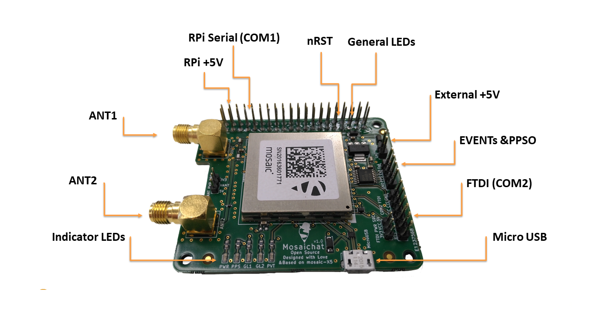

### Connecting to Raspberry Pi

#### Preparing Raspberry Pi

To enable communication between mosaicHAT and Raspberry Pi (RPi), you should make sure needed communication permissions are set. We've tested mosaicHAT with both Raspbian OS and Ubuntu OS on RPi and found the following points needed.

##### Raspbian OS
- To enable RPi serial communication, go to terminal and run:

  `sudo raspi-config`

- Select **Interfacing Options**, then from the menu select **Serial**. You will get the question:

  *Would you like a login shell to be accessible over serial?*

  Select **No**. Another prompt will ask:

  *Would you like the serial port hardware to be enabled?*

  Select **Yes**.

- Finally, exit the config and reboot RPi for changes to take effect.

##### Ubuntu OS

- To enable RPi's UART, go to `/boot/config.txt` and set `enable_uart=1` at the end of the file. This could be done directly on SD card or using:
 
  `sudo nano /boot/config.txt` 

- You will also need to disable UART console login. To do so on RPi 4, use:

  `sudo nano /boot/firmware/nobtcmd.txt` 

  And delete `console=ttyAMA0,115200` from the file. For different RPi versions, the cmd configuration file could be `/boot/cmdline.txt`.

- TCP/IP over USB may not be enabled by default. To enable TCP/IP over USB, go to:

  `sudo nano /etc/network/interfaces`

  And add:
  ```
  allow-hotplug usb0

  iface usb0 inet dhcp
  ```
-  Reboot RPi for changes to take effect.

#### Connecting an antenna
In order to benefit from the multiple signals and constellations that the mosaicHAT board has it is recommended to purchase a capable multiband antenna.
There are several GNSS antenna manufacturers in the market (e.g. Maxtenna, Tallysman, etc). For more information you can also contact Septentrio.

There are also different antenna types each of them suitable for different applications (e.g. robotics, larger machines, etc). Surely the larger the antenna the better performance you might get, however it is not all about size but also quality of antenna elements themselves.

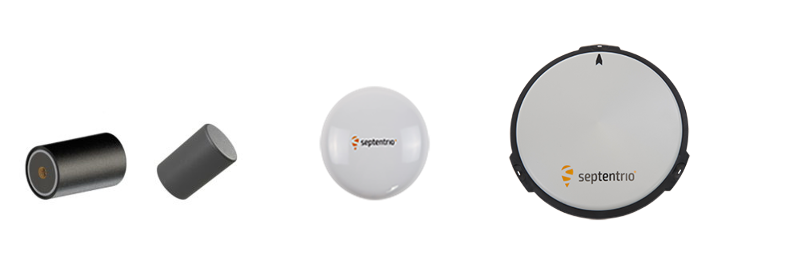

Please make sure you get the right jumper so you can also set the right voltage depending on the chosen GNSS antenna.

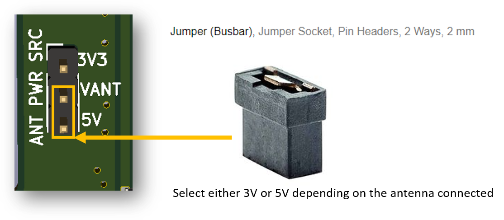

In the following photo, a Tallysman antenna has been connected to mosaicHAT. Jumper has been placed to supply 5V to antenna.

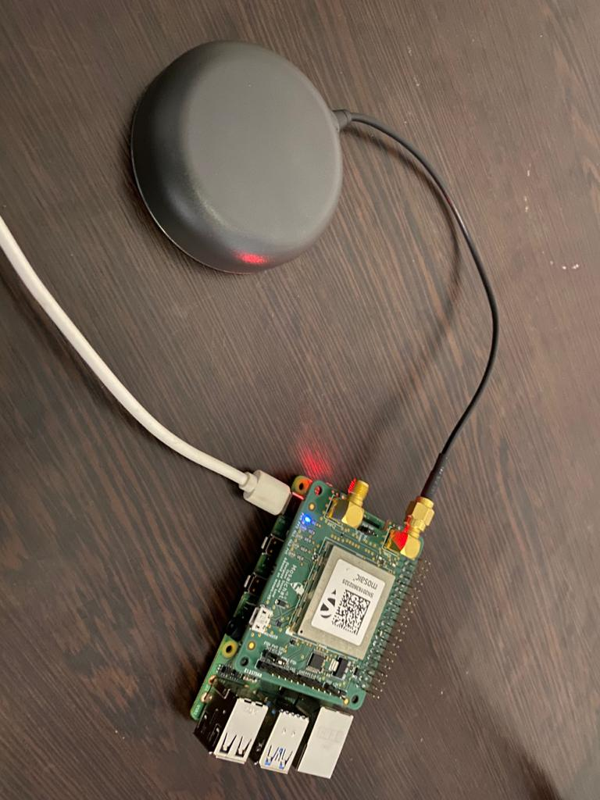

#### USB Communication

Connecting RPi, as well as any other PC, to mosaic via USB provides:
- Septentrio's web interface
- Two USB serial ports
- Multiple TCP/IP ports

The Windows USB driver provided with mosaicHAT emulates two virtual serial ports, which
can be used as standard COM ports to access the receiver. The Windows USB diver can be
installed through the RxTools software suite. 

Septentrio's RxTools is a SW which can be used to communicate to the mosaicHAT and can be downloaded free of charge from the [Septentrio support site](https://www.septentrio.com/en/support/software/rxtools).

On Linux, the standard Linux CDC-ACM driver is suitable. Most terminal emulation programs will make no distinction between virtual and
native COM ports. Note that the port settings (baud rate, etc) for virtual serial ports are not
relevant, and can be left in their default configuration in the terminal emulation program.
When connecting the USB cable to a Windows PC, a new drive appears in the file manager.
This drive contains an installer for the USB driver. Running this installer is not needed if
you have already installed the RxTools suite. 

When the USB cable is connected, the receiver supports Ethernet-over-USB. The IP address
allocated to the Ethernet-over-USB interface is 192.168.3.1. The Web user interface of the receiver can then be accessed using (http://192.168.3.1).

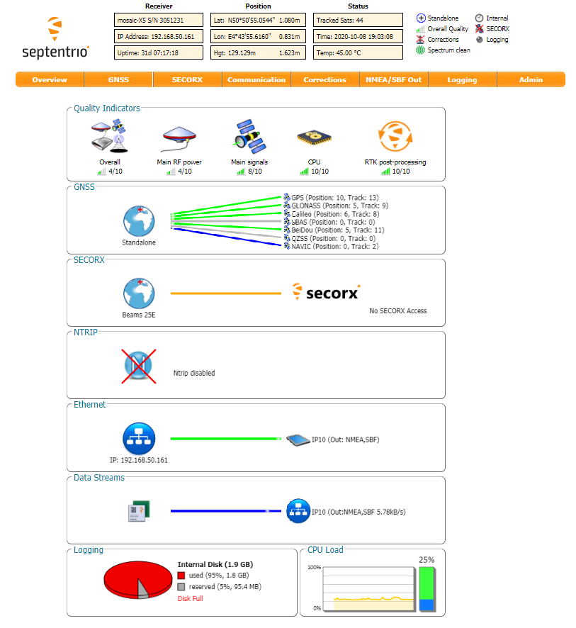

USB communication with mosaicHAT could be tested using tools like [PuTTY](https://www.putty.org/). For example, here USB1 serial port is accessed to stream NMEA GGA messages:

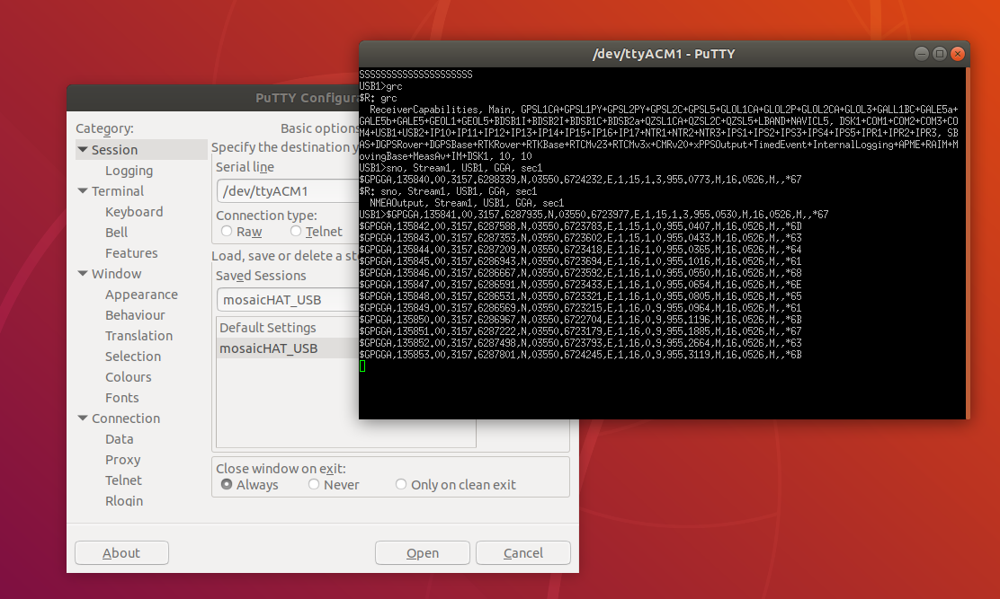

TCP/IP ports could be also tested using PuTTY, or directly from terminal. Note that 28784 is the default TCP command port: 

`telnet 192.168.3.1 28784`


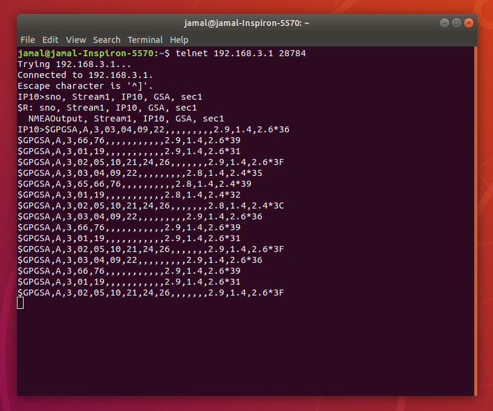

More information on how to configure or access the web interface, USB serial and USB TCP can be found in the mosaic-X5 reference guide. You can download this one from [Septentrio support site](https://www.septentrio.com/en/support/mosaic/mosaic-x5).

#### Serial Communication

A simple way to communicate with the mosaicHAT receiver is to connect one of its COM-ports.
The mosaicHAT offers 2 COM port connectors:
   * *COM connector to Raspberry-Pi*: The std connector of Raspberry Pi systems offer a serial communication. The mosaic-X5 COM1 port is connected to the Raspberry-Pi for easy integration.
   * *COM on the board (usable for FTDI)*: An extra serial port (COM2 of the mosaic-X5) is exposed via another connector on the board. This port (TTL levels) can be usable as a secondary port or can also be usable to connect an FTDI converter (e.g. serial to Bluetooth or TTL to RS232 converter). See next FTDI section
   
default COM-port settings are:
|Parameter|Value|
|--------|----------|
|baud rate | 115200 |
|data bits| 8|
|parity| no|
|stop bits| 1|
|flow control| none|

The baud rate can be modified at any time by using the *setCOMSettings* command.
Septentrio's RxTools is a SW which can be used to communicate to the mosaicHAT and can be downloaded free of charge from the [Septentrio support site](https://www.septentrio.com/en/support/software/rxtools).
Once you have downloaded it you can use Septentrio's RxControl and Data Link which can communicate with the receiver over a COM-port connection:
select Serial Connection option when opening the connection to the receiver.

#### FTDI Connector
As mentioned an extra serial port is made available and can be used as an FTDI. The pins are aligned with standard FTDI conformity thus you can add support for converting the TTL to an RS-232 or USB signals. FTDI can also be used with some Bluetooth devices. There is a large variety of FTDI devices which can help in communicating with the mosaicHAT. 


Example of an FTDI (USB cable)


In the following example, the common Bluetooth module (HC-06) has been used to control mosaicHAT from Android mobile phone. Note that most modules have a default 9600 baud rate while mosaic's default is 115200. Both devices should be set to the same baud rate for proper communication.

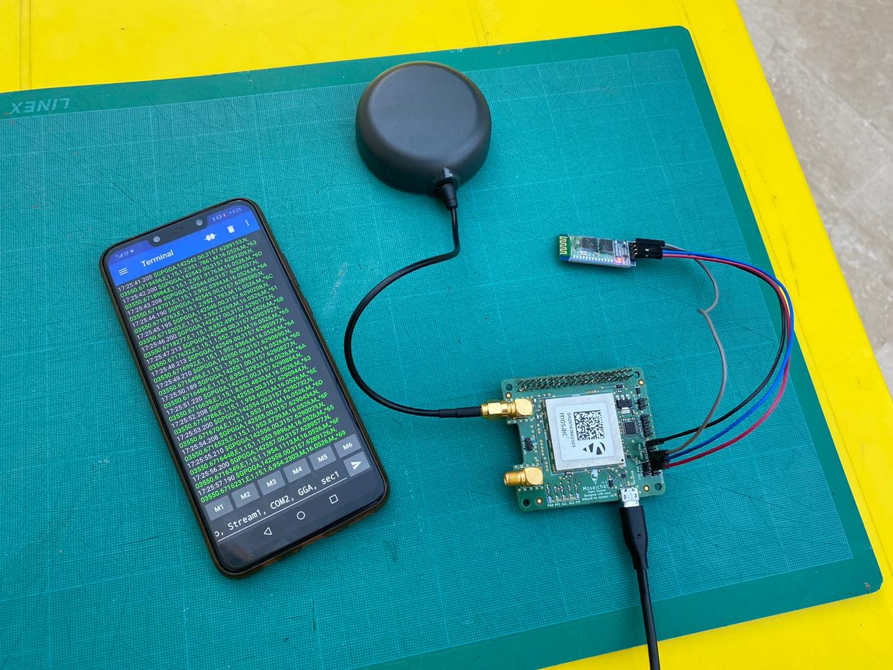

#### General Purpose LEDs
The following LEDs are defined on the mosaicHAT:
|LED|Description|
|--------|----------|
|1| Power LED|
|2| PPS LED|
|3| GL1 LED - controled by the Raspberry Pi |
|4| GL2 LED - controled by the Raspberry Pi|
|5| PVT LED|

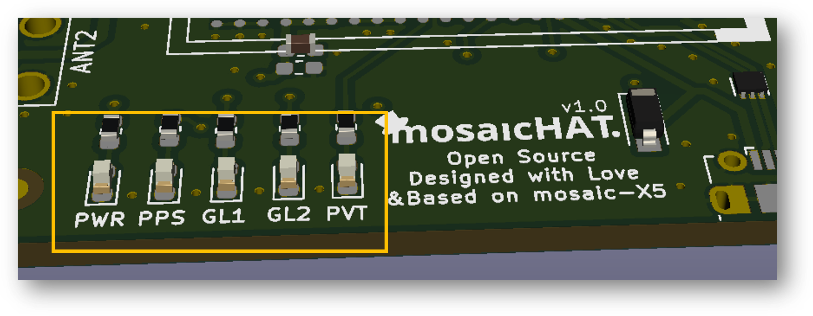

// JAMAL to explain how can this be controled from Raspberry Pi


#### Reset connector
A pin reset is also available via the Raspberry Pi connector. This is connected directly to the reset pin of the mosaicHAT.

// JAMAL to explain which pin is used
// JAMAL to explain how can this be controled from Raspberry Pi


#### Events
The receiver can time-tag electrical level transitions on its Event input with an accuracy of 20ns.
By default, the receiver reacts on low-to-high transitions but can also be configured on the receiver using **setEventParameters command**.
Upon detection of a transition, the receiver can output the time and/or the position at the instant of the event. This will be output in the Septentrio Binary Format.

Events can be used as an example for UAV Photogrametry (tagging the pictures taken either by a UAV or a robot).

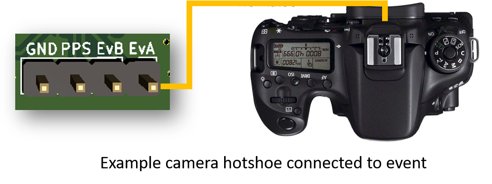

EVENTs could be tested directly on mosaicHAT board by connecting PPS Output to one of the EVENTs pins. Note that this works with a single wire because they share the same GND. Here EVENTA is connected to PPSO, with PPS interval set to 1 sec. 

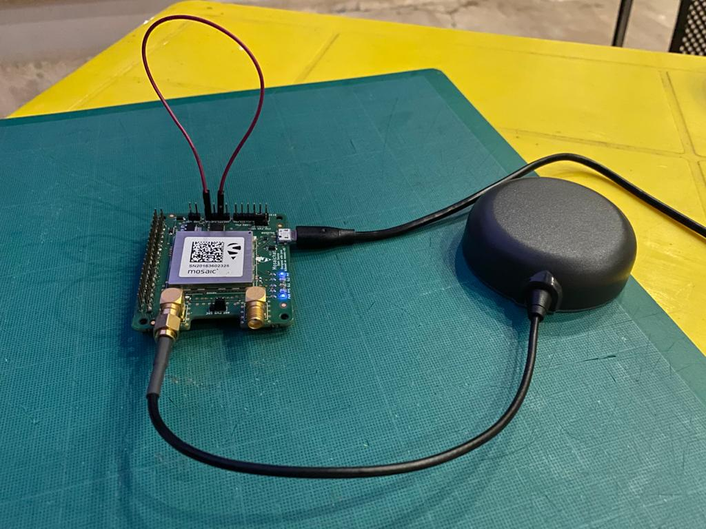

To monitor EVENTs through web interface, go to PPS/Timing from GNSS menu:

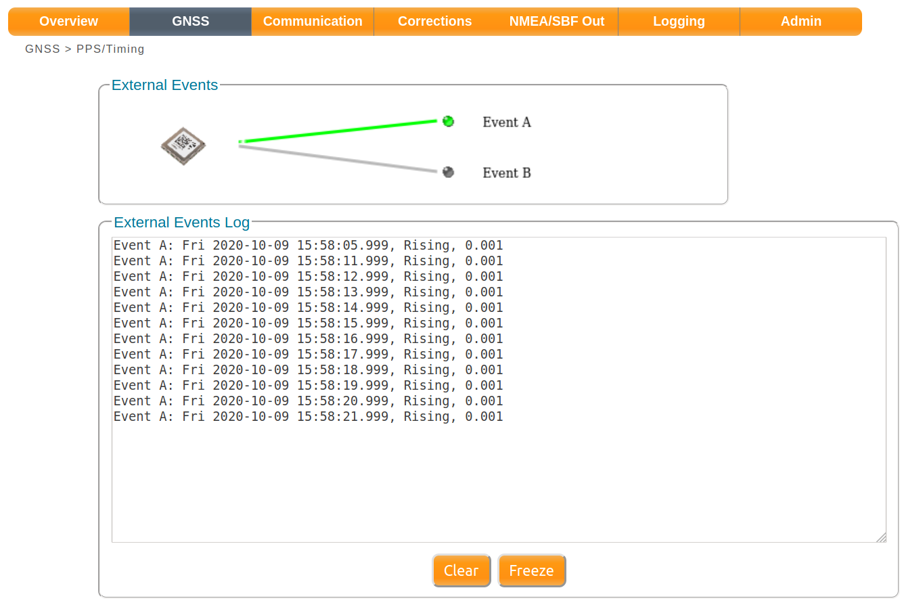

More information on the Events input of mosaic-X5 can be found in the mosaic-X5 reference guide. You can download this one from [Septentrio support site](https://www.septentrio.com/en/support/mosaic/mosaic-x5).

#### PPS Output
PPS signals are used for precise timekeeping and time measurement. One increasingly common use is in time synchronization with other sensors (e.g. Lidars or IMUs). 

The receiver is able to generate an x-pulse-per-second (xPPS) signal aligned with either GPS, Galileo or GLONASS system time, or with UTC, or with the internal receiver time.

//JAMAL to explain which pin is used
  
More information on the definition of PPS output or on how to configure the PPS parameters can be found in the mosaic-X5 reference guide. You can download this one from [Septentrio support site](https://www.septentrio.com/en/support/mosaic/mosaic-x5).


#### ROS support with ROSaic

The mosaic-X5 but also mosaicHAT are supported by ROSaic. ROSaic is a ROS driver for the mosaic modules and allows you to do integrations for robotic applications.
ROSaic is also an open source project and can be found here:
   * [http://wiki.ros.org/rosaic](http://wiki.ros.org/rosaic)
   * [https://github.com/septentrio-gnss/rosaic](https://github.com/septentrio-gnss/rosaic)

## mosaicHAT Design documentation

This section is intended for people who want to understand more about the design of the mosaicHAT.

### Design Overview
mosaicHAT is a 4-Layer Printed Circuit Board (PCB) designed to stack on top of Raspberry Pi. Both Top and Back layers are used for power and signals. The first inner layer is a GND plane whereas the second inner layer functions as a 3.3V power plane with a slight use of other connections.

Other than the female Raspberry Pi connecter, all components are placed on the Top layer. All components are Surface Mount Devices (SMD) except for connectors.

mosaicHAT was designed using [KiCAD](https://kicad-pcb.org), an open source suite for Electric Design Automation. KiCAD provides a beautiful 3D viewer besides its design capabilities.

Following is the schematic plan, for higher quality check [PDF schematic](mosaicHAT_schematic.pdf).

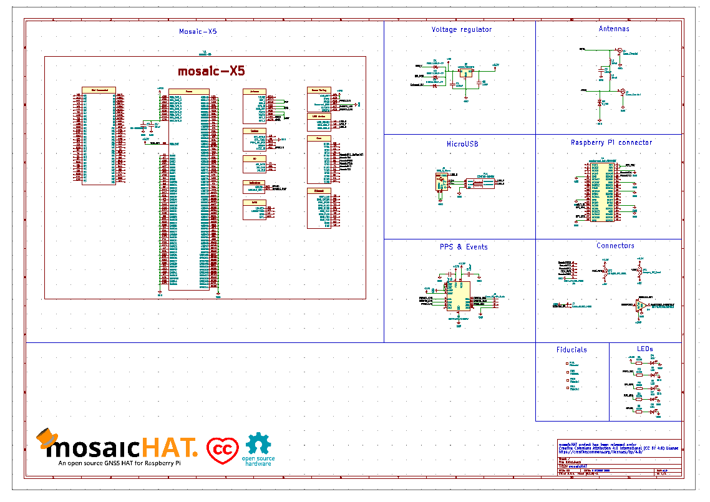

The board layout, hiding filled areas in zones. 

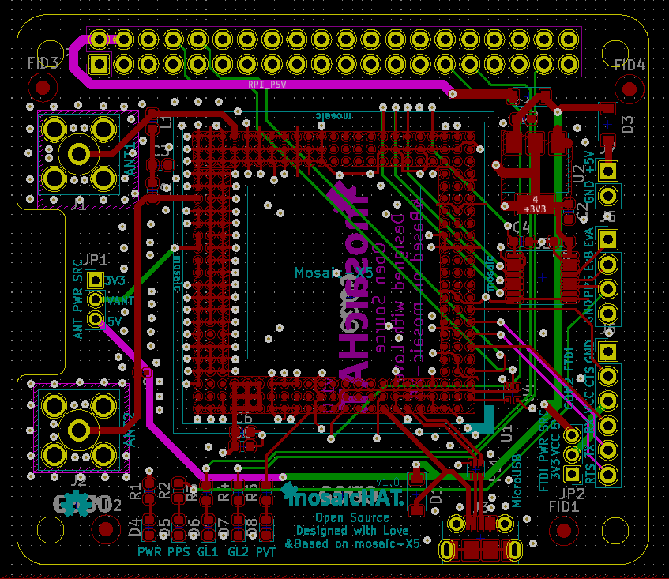

- Layer 1: Red traces, trace free zones are filled with GND copper pour.

- Layer 2: Full GND plane.

- Layer 3: Pink traces, trace free zones make a 3.3V power plane.

- Layer 4: Green traces, trace free zones are filled with GND copper pour.


A top 3D view of mosaicHAT, featuring main electronic components.

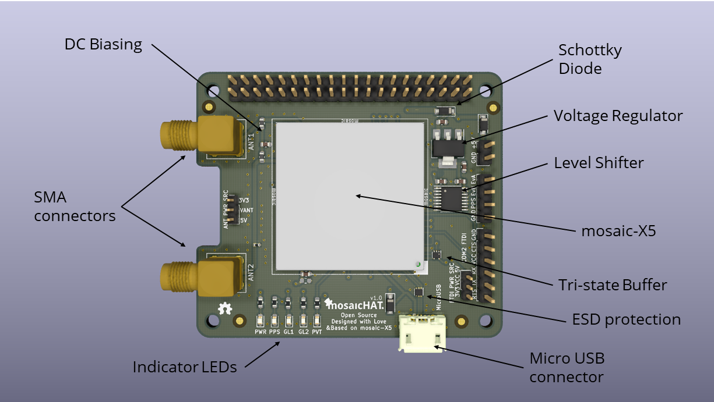

The following sections provide more details on mosaicHAT design.

### mosaic Pinout

Septentrio mosaic-X5 is the base of mosaicHAT board. mosaic is a 31x31mm LGA module with 239 pins. All needed information on mosaic connections could be found in the [Hardware Manual](Refrences/mosaic_hardware_manual_v1.3.0.pdf) 

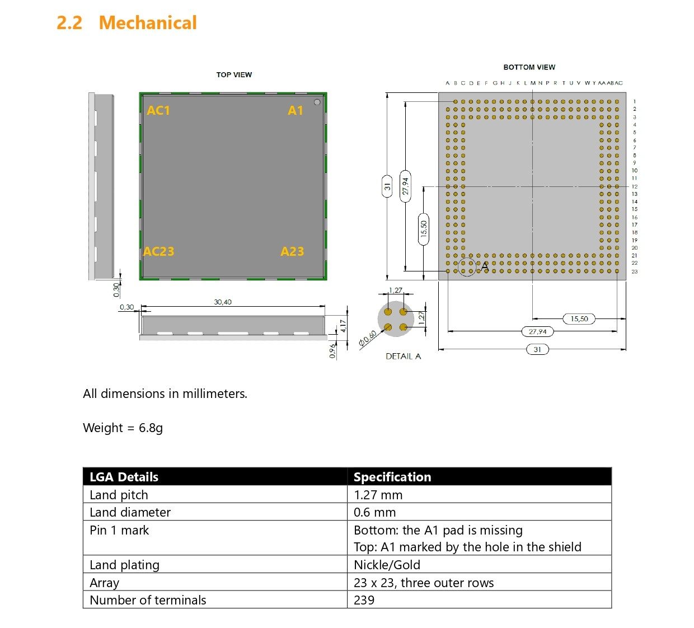

KiCAD symbol, footprint and a 3D model of mosaic could be found in folder [mosaic Design Components](mosaic_design_components).

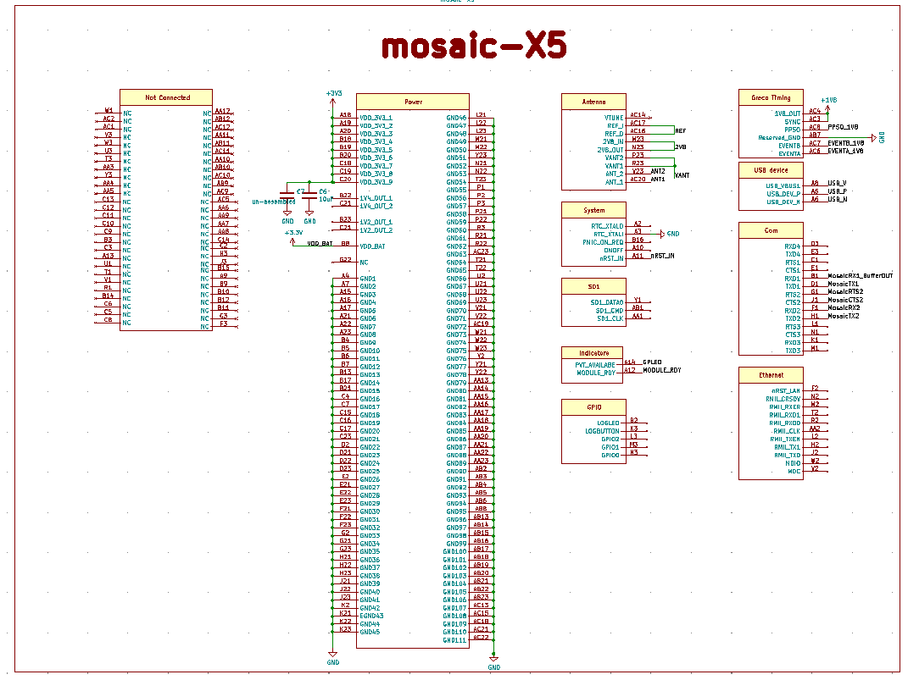

Following the manual instructions:

- The 3.3VDC supply is connected to all VDD_3V3 pins and to the VDD_BAT pin. A decoupling capacitor has been used.
- All ground pins are connected to GND.
- 1V8_OUT is connected to SYNC.
- Pin A3 (RTC_XTALI) is connected to GND.
- Pin AB7 (Reserved_GND) is connected to GND.
- All "Reserved_NC" pins are left unconnected.
- Other unused functions pins are left unconnected.

Note that a second un-assembled capacitor place has been left for debugging and testing. The second capacitor is not necessary for the function of mosaicHAT.

### Power Sources

mosaicHAT could be powered by three options; Raspberry Pi, Micro USB and external power pin headers. mosaic module itself runs on 3.3V, thus a voltage regulator is used (LD1117AS33TR). According to its datasheet, the regulator's maximum input is 15V. Raspberry Pi and Micro USB already provide 5V. User should be careful when connecting higher voltage to external power pin headers. Though 5V is preferable, user can input up to 15V only if both VANT and FTDI PWR SRC jumpers are connected to 3.3V. Pin headers of 5V in the jumpers are connected directly to the input source as it's presumed to be 5V.

Schottky diodes (MBRX120LF-TP) are used to insure one-way current direction. Decoupling capacirors (100nF and 10uF) are used according to regulator’s datasheet. Following is the power part of schematic.

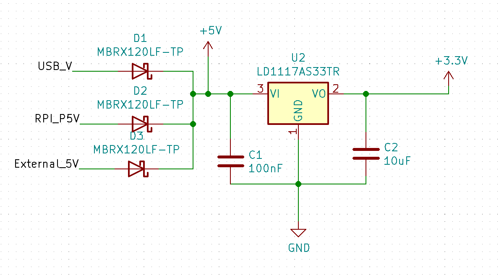


In the figure above:

1. Regulator's circuit.

2. Raspberrpi power source (5V pins).

3. External power source headers.

4. Micro USB power source.

### Antennas

// mosaic-X5 is single antenna, explain more 

mosaic is a dual-antenna module. It can perfectly function with one antenna, however, connecting a second antenna increases accuracy and enables heading sensing.

Following is the antennas part in schematic.

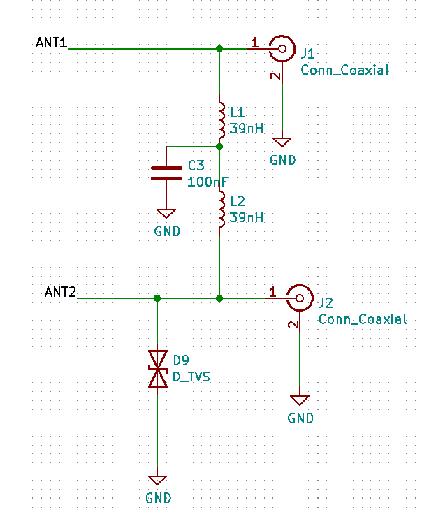
 
#### First Antenna
The first antenna SMA connector is directly connected to ANT1 pad. ANT1 is ESD-protected within the module and carries DC voltage. The DC voltage of ANT1 is supplied from mosaic's VANT pad. mosaicHAT's user could choose between 3.3V and 5V supply to VANT using 2.00 mm header jumpers.

The nominal input impedance of the RF line is 50 Ohms. Thus, antenna trace should have a characteristic impedance (Zo) of 50 Ohms. Line impedance could be measured by different tools, such as the freeware [Saturn PCB toolkit](https://saturnpcb.com/pcb_toolkit).


Right characteristic impedance (45-55 Ohms) could be reached by adjusting the width of RF line (Conductor Width) having PCB specifications fixed. Frequency is set to 1575 MHz as the GPS L1 Frequency. Conductor Hight is the thickness of the dielectric material between Top layer and the next copper layer which depends on manufacturing service and board specifications, in mosaicHAT's case it's 0.36 mm.

Having right characteristic impedance insures reduced reflections in the opposite direction thus higher quality of signals. For uniform lines, characteristic impedance is not dependent on trace length.

It is also important to stich vias every few millimetres around the RF line for good ground coherence. Stitching GND vias help to protect line from interference.


For more details on antennas and interference please refer to mosaic's [Hardware Manual](mosaicHAT/Refrences/mosaic_hardware_manual_v1.3.0.pdf).

Following is the first antenna part of board layout. The center of SMA connector is copper freed to prevent undesired capacitance due to high copper density.

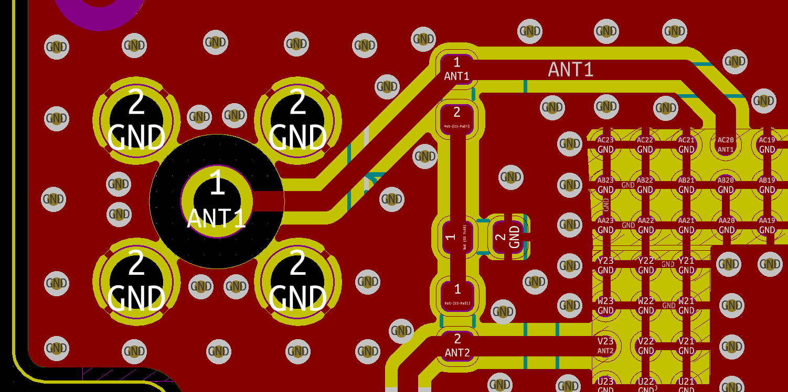

// ask about the freq

// check about capacitance

#### Second Antenna

The second antenna is similar to first antenna except that ANT2 pad in mosaic is not internally ESD-protected and does not carry DC voltage by itself. Wherefore, both protection and DC biasing are needed.

For ESD protection, TVS diode (SESD0402X1BN-0010-098) is used. TVS diode protects the module against sudden removal of the antenna. As any stubs branching out of the RF line could cause undesired reflections, TVS diode shoud be placed exactly on top of the RF trace.

Biasing inductors are used to supply the ANT2 with DC voltage from ANT1 trace. Two inductors, one for each RF line, are used to avoid stubs and provide single tracks for RF signals. The inductor value is best to be around 33 nH with self resonant frequency of 1.4 GHz. A 100 nF bypass capacitor has been placed between inductors to filter out any AC noise.


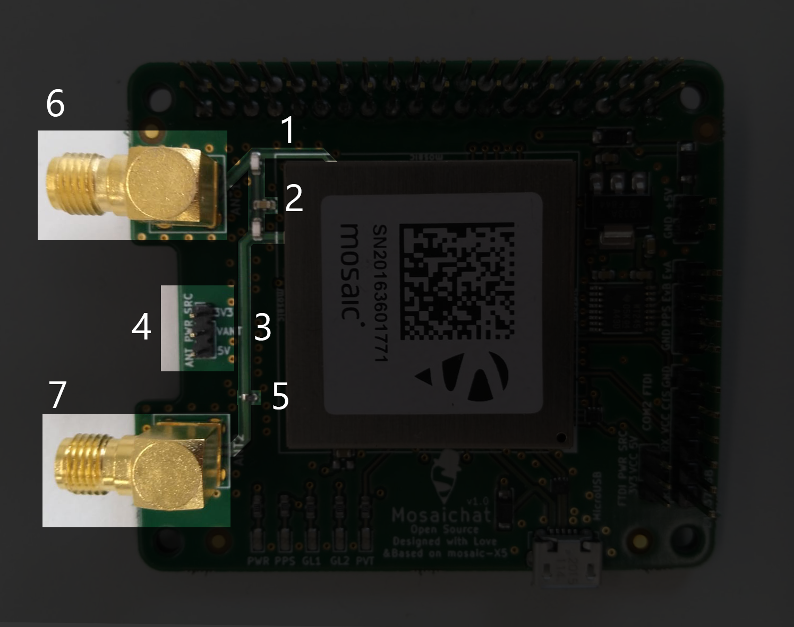

In the figure above:

1. ANT1 RF trace.

2. DC biasing circuit.

3. ANT2 RF trace.

4. VANT source jumper 2.00 mm headers.

5. TVS diode.

// highlight SMA connectors

### Raspberry Pi Serial

Serial communication with Raspberry Pi is conducted by connecting COM1 of mosaic to Raspberry Pi UART pins: TX (GPIO 14) and RX (GPIO 15). GPIO 14 is pin 8 on the GPIO header whereas GPIO 15 is pin 10. Raspberry Pi's TX is connected to mosiac's RX1 while RX is connected to mosaic's TX1.

According to the hardware manual, non-zero voltage should not be driven to mosaic's input pads while in standby mode.


Thus, MosaicRX1 signal has been tri-stated by MODULE_RDY using tri-state buffer (SN74LVC1G126DRLR). 


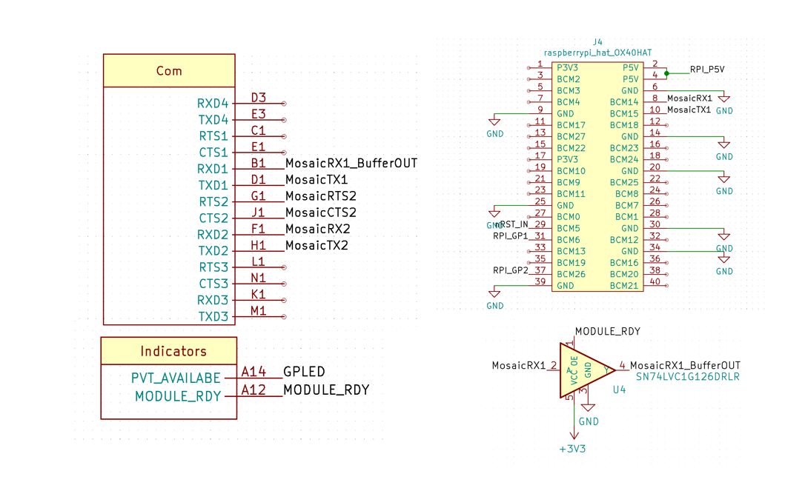

// rename buffer in schematic

### Reset Input

### Micro USB

To use mosaic as a USB device, the following pins of the module should be connected to a USB connector.


A common mode filter with ESD protection for USB 2.0 (ECMF02-2AMX6) is used with USB_DEV_P (D+) and USB_DEV_N (D-) for protection. The filter suppresses the noise of electromagnetic interference (EMI) on high speed differential USB lines.  

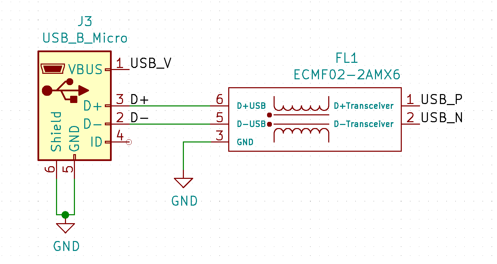

As USB uses a differential pair, differential pair impedance (Zdifferential) should be tuned to avoid reflections. Zdifferential needs to be around 90 Ohms. Zdifferential could be calculated using Saturn's PCB toolkit. For mosaicHAT USB, traces width was set to 0.35 mm with 0.15 mm spacing.

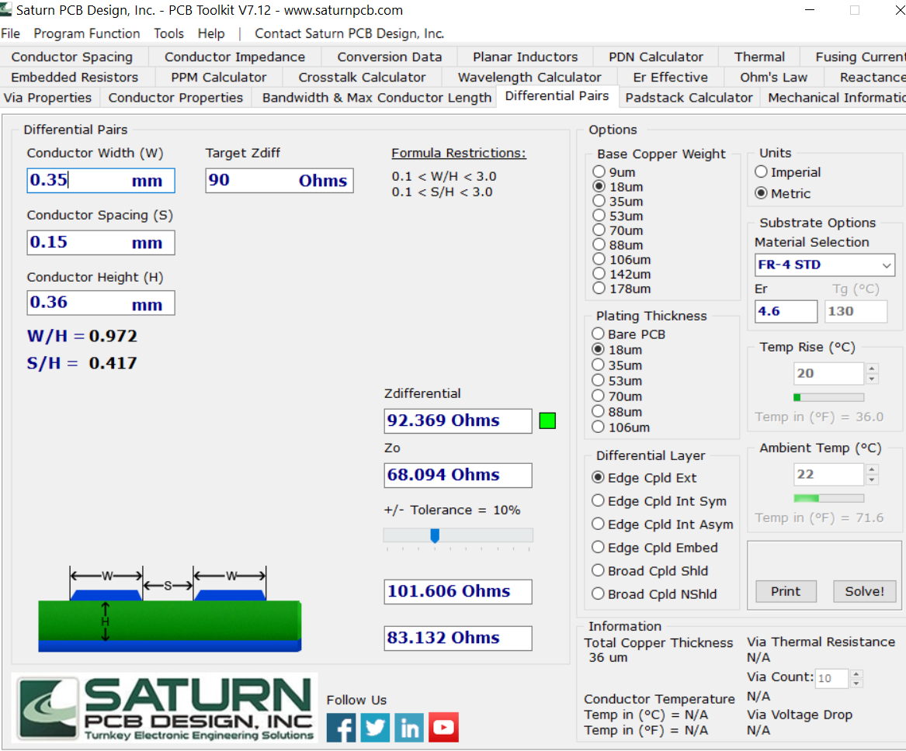

Following board figure shows USB parts highlighted. GND vias were stitched around the USB connector and lines to insure good ground coherence. 

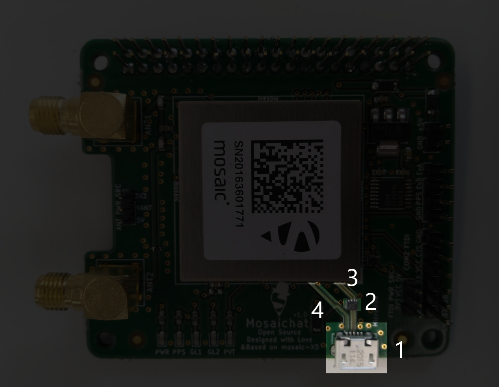


1. Micro USB connector (Molex 1050170001).

2. Common mode filter.

3. USB D+/D- lines.

4. USB_V.

### Events and PPSO

mosaic offers two event inputs which could be used to time tag external events. Both input pads of mosaic, EVENTA and EVENTB, use 1.8V level. For better integration with external applications, a level shifter (SN74AVC4T245PWR) is used to transform signals into 3.3V level.

Pulse Per Second Output (PPSO) is a mosaic clock output. Polarity, frequency and pulse width of PPSO could be configured by **setPPSParameters** command. As PPSO uses 1.8V level as well, same level shifter is used to get 3.3V level signals.

Both EVENTS and PPSO 3.3V levels are connected to 2.54 mm pin headers.

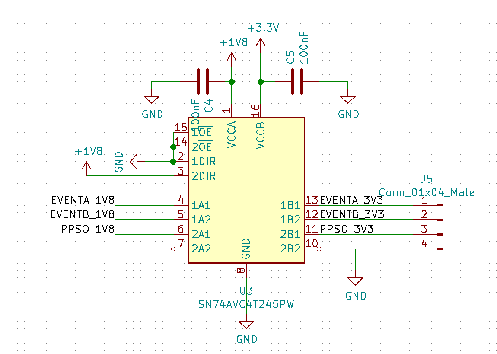

Port A tracks 1.8V while port B tracks 3.3V level. Direction could be set for two channels, each provides two connections. (1DIR) is set to low for mosaic input direction while (2DIR) is set to high for output direction. Both (O̅E̅) pins are set to low to enable low impedance state. VCCB is connected to +3.3V while VCCA is connected to +1.8V, which is supplied by 1V8_OUT pin of mosaic. Bypass capacitors are used on power supplies according to datasheet.
 
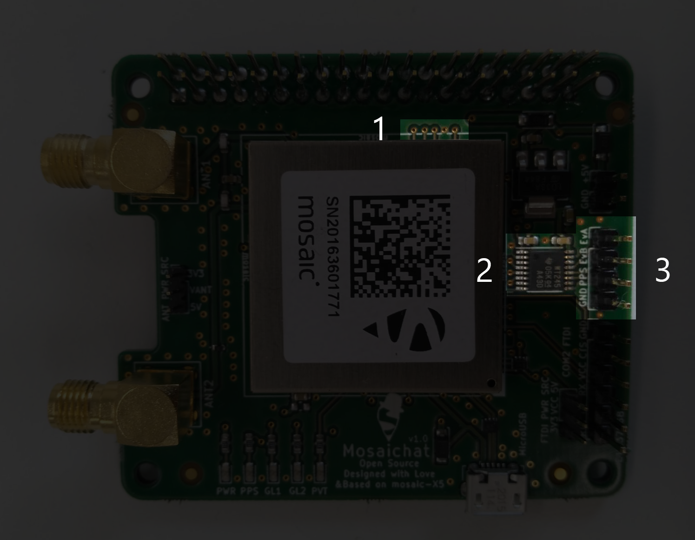

1. EVENTS, PPSO and 1V8_OUT vias, connected to level shifter via Back layer.

2. Level shifter.

3. 3.3V level pin headers.


### FTDI

Second serial connection to mosaic (COM2) is exposed through 2.54 mm pin headers. The FTDI connection could be used to communicate with other devices through serial (e.g. HC-06 Bluetooth module).

If the device needs mosaicHAT's power, like HC-06, VCC pin of FTDI could be used. 5V or 3.3V could be provided by moving The FTDI PWR SRC jumpers.

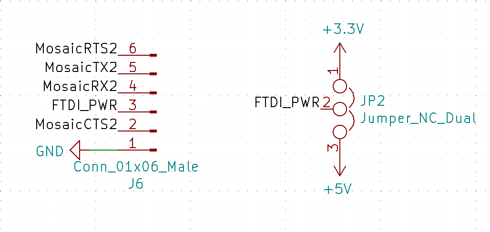

### LEDs

mosaicHAT comes with five blue indicator LEDs.

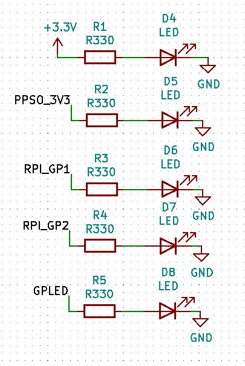

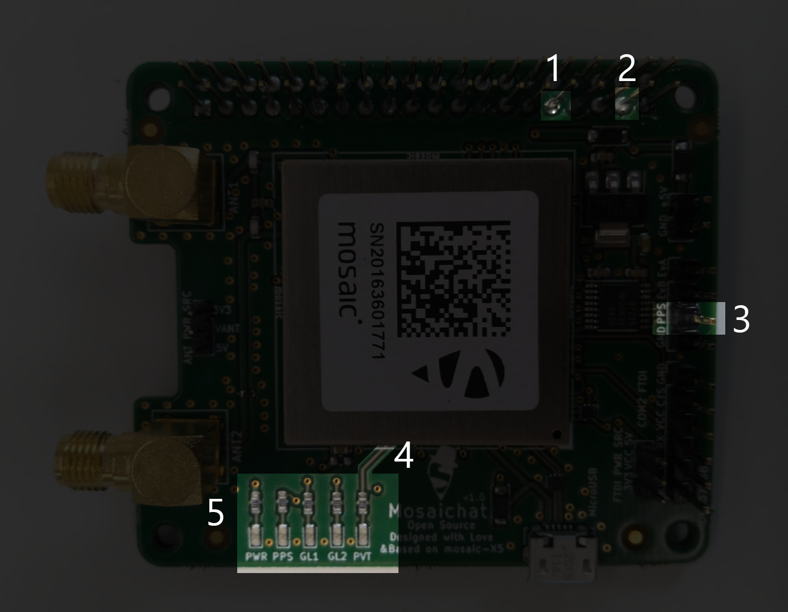

1. Raspberry Pi's (GPIO 6) which is pin 31 in header, connected to GL1 LED. 

2. Raspberry Pi's (GPIO 26) which is pin 37 in header, connected to GL2 LED. 

3. PPSO 3.3V level, connected to PPS LED.  

4. Trace to mosaic's GPLED pin, connected to PVT LED.  

5. Indicator LEDs, PWR LED is directly connected to 3.3V power plane. 

PPSO clock could be tuned using **setPPSParameters** command. While GPLED default mode is *PVTLED*, it could be configured to work in different modes (*PVTLED*, *DIFFCORLED* and *TRACKLED*) using **setLEDMode** command. Refer to the Hardware Manual for blinking behaviour of each mode. Both General LEDs (GL1 and GL2) could be directly controlled by Raspberry Pi for customized user applications.

### Clock Frequency Reference 

mosaic module embeds an internal Temperature Compensated Crystal Oscillator (TCXO) for frequency reference. The module can either use its internal TCXO frequency reference or an external frequency reference. In Mosiachat's case, internal reference is used. Following are  Hardware Manual instructions for using internal TCXO.

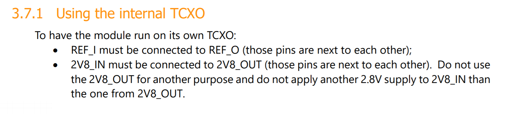

Layout connections for REF and 2V8.


## Further improvements
Further improvemts or recomendations on this project are welcome either here or on spinoff porjects.
Here some possible improvements to the current design.
   * Addition of Ethernet communication
   * Addition of I2C communication or similar to aid further HAT stacks
   * Further support for mosaic-T receiver (proper timing signals exposure)
   * Communication module (to aid corrections input)


