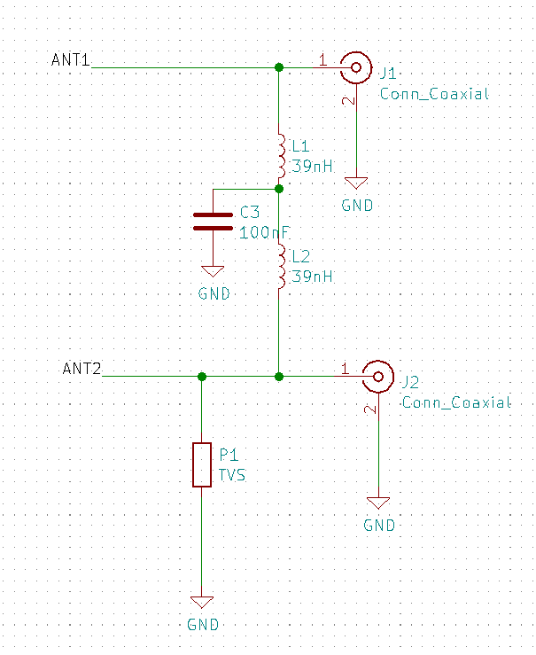
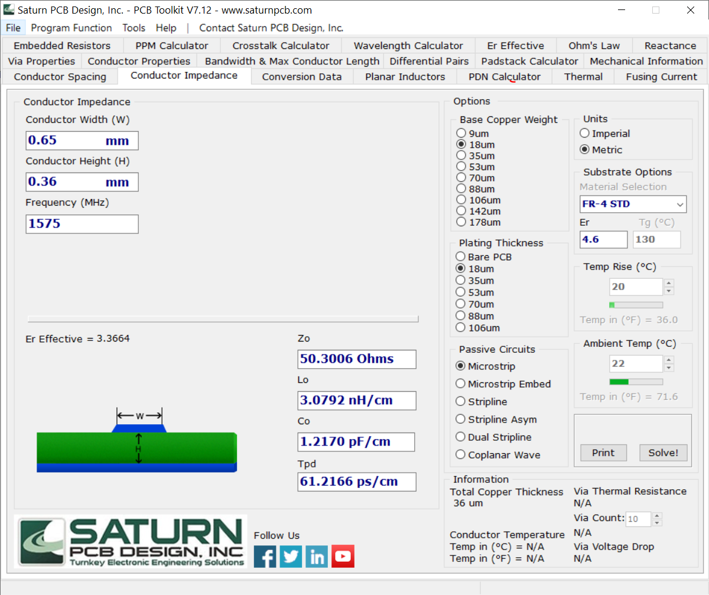

# Mosaichat
## 1. Mosaichat Design
### 1.1 Design Overview
Mosaichat is a 4-Layer Printed Circuit Board (PCB) designed to stack on top of Raspberry Pi. Both Top and Back layers are used for power and signals. The first inner layer is a GND plane whereas the second inner layer functions as a 3.3V power plane with a slight use of other connections.

Other than the female Raspberry Pi connecter, all components are placed on the Top layer. All components are Surface Mount Devices (SMD) except for connectors.

Mosaichat was designed using [KiCAD](https://kicad-pcb.org), an open source suite for Electric Design Automation. KiCAD provides a beautiful 3D viewer besides its design capabilities.

Following is the schematic plan, for higher quility check [PDF plan](schematic.pdf).

A top 3D view of Mosaichat showing main components.

The following sections provide more details on Mosaichat design.

### 1.2 mosaic Pinout

// to add later

### 1.3 Power Sources

Mosaichat could be powered by three options; Raspberry Pi, Micro USB and external power pin headers. mosaic module itself runs on 3.3V, thus a voltage regulator is used (LD1117AS33TR). According to its datasheet, the regulator's maximum input is 15V. Raspberry Pi and Micro USB already provide 5V. User should be careful when connecting higher voltage to external power pin headers. Though 5V is preferable, user can input up to 15V only if both VANT and FTDI PWR SRC jumpers are connected to 3.3V. Pin headers of 5V in the jumpers are connected directly to the input source as it's presumed to be 5V.

Schottky diodes (MBRX120LF-TP) are used to insure one-way current direction. Decoupling capacirors (100nF and 10uF) are used according to regualtor's datasheet. 

// to add photo & highlighted parts

### 1.4 Antennas

mosaic is a dual-antenna module. It can perfectly function with one antenna, however, connecting a second antenna increases accuracy and enables orientation sensing.

Following is the antennas part in schematic.

 
#### 1.4.2	First Antenna
The first antenna SMA connector is directly connected to ANT1 pad. ANT1 is ESD-protected within the module and carries DC voltage. For more details on antennas check mosaic's [Hardware Manual](HWManual.pdf)

The nominal input impedence of the RF line is 50 Ohms. Thus, antenna trace should have a charachtaristic impdence (Zo) of 50 Ohms. Line impedence could be measured by different tools, such as the freeware [Saturn PCB toolkit](https://saturnpcb.com/pcb_toolkit).

Right charachteristic impedence (45-55 Ohms) could be reached by adjusting the width of RF line (Conductor Width) having PCB specifications fixed. Frequency is set to 1575 MHz as the GPS L1 Frequency. Conductor Hight is the thickness of the dielectric material between Top layer and the next copper layer which depends on manufacturing service and board specifications, in Mosaichat's case it's 0.36 mm.

Having right characteristic impedence insures reduced reflections in the opposite direction thus higher quality of signals. For uniform lines, charachterstic impedence is not dependent on trace length.

// ask about the freq

#### 1.4.3	Second Antenna

