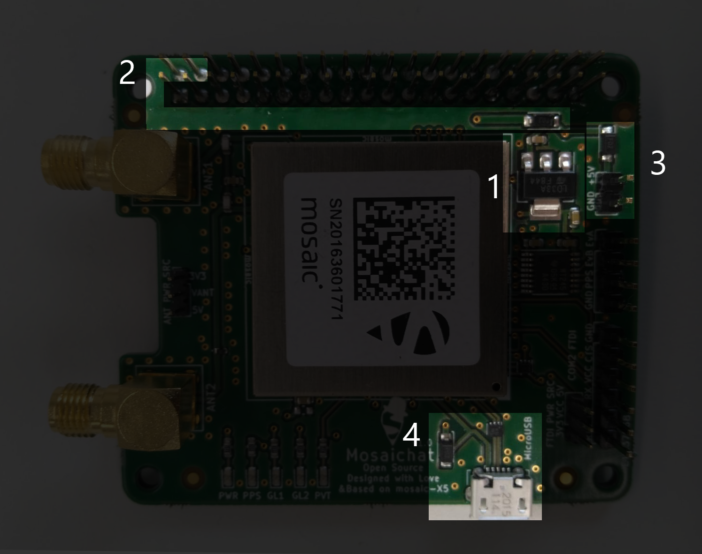
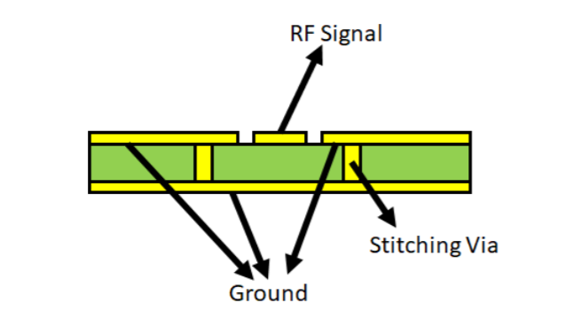
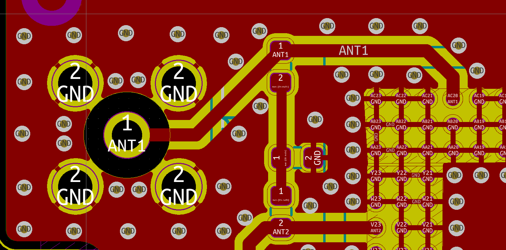
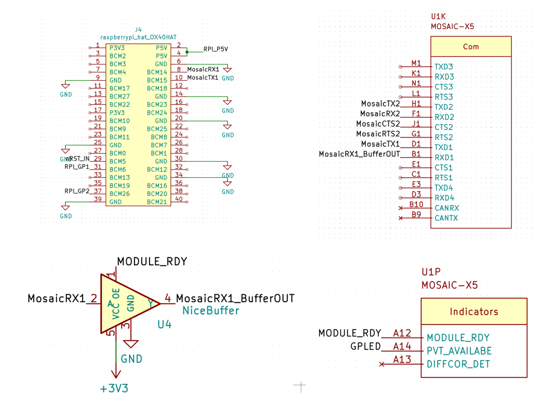

# Mosaichat

## 0.	Connecting to Raspberry Pi
### 0.1	Setting Up Mosaichat
### 0.2	Serial Communication
### 0.3	Input Reset
### 0.4	General Purpose LEDs
### 0.5	USB Communication
### 0.6	Applications

## 1. Mosaichat Design
### 1.1 Design Overview
Mosaichat is a 4-Layer Printed Circuit Board (PCB) designed to stack on top of Raspberry Pi. Both Top and Back layers are used for power and signals. The first inner layer is a GND plane whereas the second inner layer functions as a 3.3V power plane with a slight use of other connections.

Other than the female Raspberry Pi connecter, all components are placed on the Top layer. All components are Surface Mount Devices (SMD) except for connectors.

Mosaichat was designed using [KiCAD](https://kicad-pcb.org), an open source suite for Electric Design Automation. KiCAD provides a beautiful 3D viewer besides its design capabilities.

Following is the schematic plan, for higher quality check [PDF plan](schematic.pdf).

A top 3D view of Mosaichat showing main components.

The following sections provide more details on Mosaichat design.

### 1.2 mosaic Pinout

// to add later

### 1.3 Power Sources

Mosaichat could be powered by three options; Raspberry Pi, Micro USB and external power pin headers. mosaic module itself runs on 3.3V, thus a voltage regulator is used (LD1117AS33TR). According to its datasheet, the regulator's maximum input is 15V. Raspberry Pi and Micro USB already provide 5V. User should be careful when connecting higher voltage to external power pin headers. Though 5V is preferable, user can input up to 15V only if both VANT and FTDI PWR SRC jumpers are connected to 3.3V. Pin headers of 5V in the jumpers are connected directly to the input source as it's presumed to be 5V.

Schottky diodes (MBRX120LF-TP) are used to insure one-way current direction. Decoupling capacirors (100nF and 10uF) are used according to regulator’s datasheet. Following is the power part of schematic.

In the figure above:

1. Regulator's circuit.

2. Raspberrpi power source (5V pins).

3. External power source headers.

4. Micro USB power source.

### 1.4 Antennas

mosaic is a dual-antenna module. It can perfectly function with one antenna, however, connecting a second antenna increases accuracy and enables heading sensing.

Following is the antennas part in schematic.

 
#### 1.4.2	First Antenna
The first antenna SMA connector is directly connected to ANT1 pad. ANT1 is ESD-protected within the module and carries DC voltage. The DC voltage of ANT1 is supplied from mosaic's VANT pad. Mosaichat's user could choose between 3.3V and 5V supply to VANT using 2.00 mm header jumpers.

The nominal input impedance of the RF line is 50 Ohms. Thus, antenna trace should have a characteristic impedance (Zo) of 50 Ohms. Line impedance could be measured by different tools, such as the freeware [Saturn PCB toolkit](https://saturnpcb.com/pcb_toolkit).

Right characteristic impedance (45-55 Ohms) could be reached by adjusting the width of RF line (Conductor Width) having PCB specifications fixed. Frequency is set to 1575 MHz as the GPS L1 Frequency. Conductor Hight is the thickness of the dielectric material between Top layer and the next copper layer which depends on manufacturing service and board specifications, in Mosaichat's case it's 0.36 mm.

Having right characteristic impedance insures reduced reflections in the opposite direction thus higher quality of signals. For uniform lines, characteristic impedance is not dependent on trace length.

It is also important to stich vias every few millimetres around the RF line for good ground coherence. Stitching GND vias help to protect line from interference.

For more details on antennas and interference please refer to mosaic's [Hardware Manual](HWManual.pdf).

Following is the first antenna part of board layout. The center of SMA connector is copper freed to prevent undesired capacitance due to high copper density.

// ask about the freq

// check about capacitance

#### 1.4.3	Second Antenna

The second antenna is similar to first antenna except that ANT2 pad in mosaic is not internally ESD-protected and does not carry DC voltage by itself. Wherefore, both protection and DC biasing are needed.

For ESD protection, TVS diode (SESD0402X1BN-0010-098) is used. TVS diode protects the module against sudden removal of the antenna. As any stubs branching out of the RF line could cause undesired reflections, TVS diode shoud be placed exactly on top of the RF trace.

Biasing inductors are used to supply the ANT2 with DC voltage from ANT1 trace. Two inductors, one for each RF line, are used to avoid stubs and provide single tracks for RF signals. The inductor value is best to be around 33 nH with self resonant frequency of 1.4 GHz. A 100 nF bypass capacitor has been placed between inductors to filter out any AC noise.

In the figure above:

1. ANT1 RF trace.

2. DC biasing circuit.

3. ANT2 RF trace.

4. VANT source jumper 2.00 mm headers.

5. TVS diode.

### 1.5	Raspberry Pi Serial

Serial communication with Raspberry Pi is conducted by connecting COM1 of mosaic to Raspberry Pi UART pins: Tx (GPIO 14) and Rx (GPIO 15). GPIO 14 is pin 8 on the GPIO header whereas GPIO 15 is pin 10. 

### 1.10	Reset Input

### 1.6	Micro USB

### 1.7	PPS and Events

### 1.8	FTDI

### 1.9	LEDs

### 1.11	Clock Frequency Reference 

